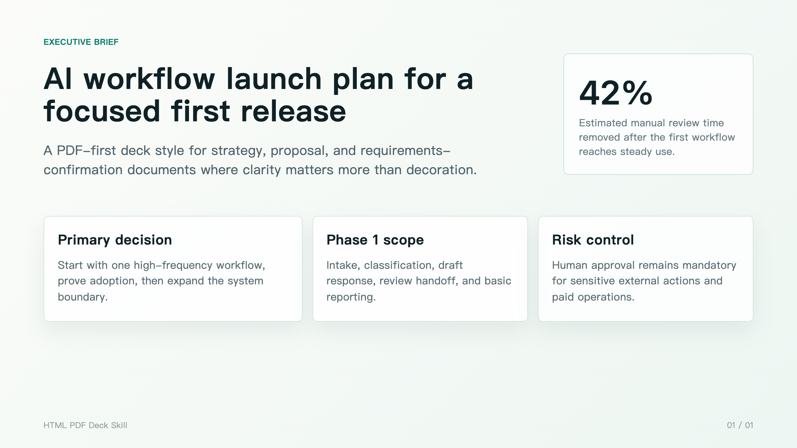
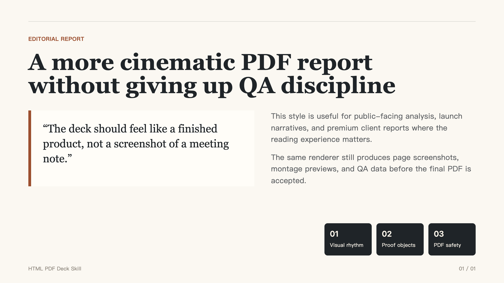
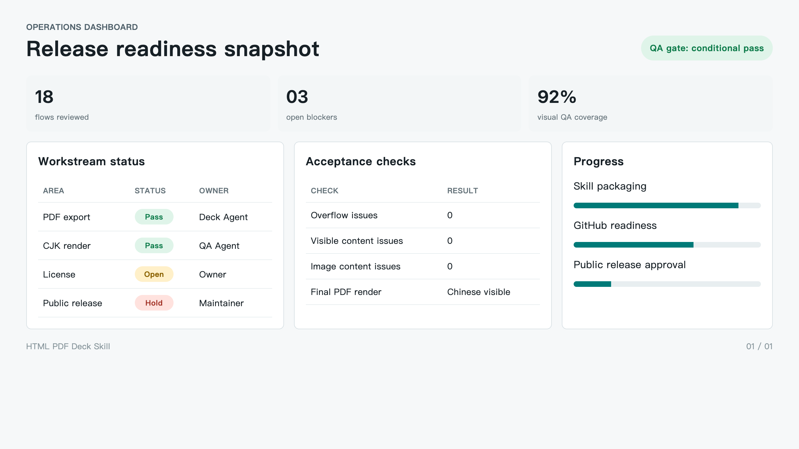

# HTML PDF Deck Agent Skill

一个用于生成高质感 HTML/CSS 视觉型演示文稿，并导出中文/CJK 安全 PDF 的 Agent Skill。

它适合用于客户报告、方案 PDF、需求确认书、诊断报告、报价/提案材料，以及任何需要“先做漂亮 PDF，再按需做 PPTX”的交付场景。

> 当前状态：私有发布候选。公开发布前仍需确认开源许可证，并由项目所有者明确批准。

## 这个 Skill 解决什么问题

很多 Agent 能写内容，但难点在于稳定产出一份能交付的视觉 PDF：

- 页面不能溢出。
- 不能只有背景没有正文。
- 中文不能在实际导出的 PDF 里消失。
- 最终文件要看起来像一份完成品，而不是临时截图。

这个 Skill 把流程固定下来：用 HTML/CSS 设计页面，用本地渲染生成预览图和 QA 数据，再把逐页截图封装成最终 PDF，优先保证视觉稳定和中文可见。

## 效果示例

| Executive Brief | Editorial Report | Operations Dashboard |
|---|---|---|
|  |  |  |

## 它会生成什么

对于 `report.html`，输出目录会包含：

```text
report.pdf          # 最终交付 PDF，由逐页截图封装，中文显示更稳定
report-vector.pdf   # Chromium 向量 PDF，仅用于调试
preview/page-01.png
preview/page-02.png
montage.png
qa.json
```

重点规则：

- 交付给客户的是 `<name>.pdf`。
- `*-vector.pdf` 不是默认交付件。
- 中文/CJK 文件必须检查实际导出的 PDF，而不是只看浏览器预览。

## 安装

```bash
npm install
```

## 作为 Codex Skill 使用

这个仓库根目录本身就是 Skill 目录，因为它包含 `SKILL.md`。

安装到 Codex skills 目录后，可以这样调用：

```text
Use $html-pdf-deck to create a polished PDF-first deck from HTML/CSS and verify the exported PDF.
```

## 平台兼容性

这个项目优先适配 Codex，但不是 Codex-only。

它的核心是通用的 `SKILL.md` + `scripts/` + `references/` + `assets/` 结构，因此理论上可以被其他兼容 `SKILL.md` 的智能体复用，也可以适配到支持 Skill、插件、工作流或本地工具执行的平台。

当前兼容性矩阵见：

[docs/COMPATIBILITY.md](docs/COMPATIBILITY.md)

其中包括 Codex、Claude、OpenClaw、Hermes Agent、VS Code Copilot Agent Skills、腾讯 CodeBuddy/WorkBuddy、扣子 Coze 等平台的适配状态。

没有写进去的平台不代表不能使用，只是目前没有完成验证。

## 常用命令

```bash
npm run validate:skill
npm run smoke
npm run smoke:cjk
npm run demo:all
npm run render -- /absolute/path/report.html /absolute/path/output-dir
```

## HTML 页面约定

每一页使用一个 `.slide` 元素：

```html
<section class="slide">
  <div class="content">
    <h1>Slide title</h1>
    <p>Slide body</p>
  </div>
</section>
```

默认画布：

```text
1280 x 720
```

## 交付验收

`qa.json` 里的这些字段必须为 0：

```json
{
  "overflow_issue_count": 0,
  "content_visibility_issue_count": 0,
  "image_content_issue_count": 0
}
```

同时还要检查：

- `montage.png` 每页内容完整。
- 中文/CJK 最终 PDF 用真实 PDF 阅读器打开后文字可见。
- 不把 `*-vector.pdf` 当作最终交付文件。

## 中文 PDF 为什么要特殊处理

Chromium 生成的向量 PDF 在某些 PDF 阅读器里可能丢失中文、日文或韩文字形。这个问题可能不会出现在 HTML 页面或 PNG 预览里，而是出现在实际导出的 PDF 文件里。

因此，本 Skill 默认把逐页 PNG 重新封装成最终 `<name>.pdf`，优先保证收件人看到的视觉结果正确。

详细说明见：

[docs/CJK_PDF_SAFETY.md](docs/CJK_PDF_SAFETY.md)

## 当前开源状态

可以作为开源候选，但公开发布前仍需完成：

- 确认仓库名称和包名。
- 选择开源许可证。
- 先创建 GitHub private repo。
- 跑通 GitHub Actions。
- 最终确认是否公开。

完整清单见：

[OPEN_SOURCE_PREP_CHECKLIST.md](OPEN_SOURCE_PREP_CHECKLIST.md)

## License

当前尚未授予公开许可证。公开前必须由项目所有者确认 license。
